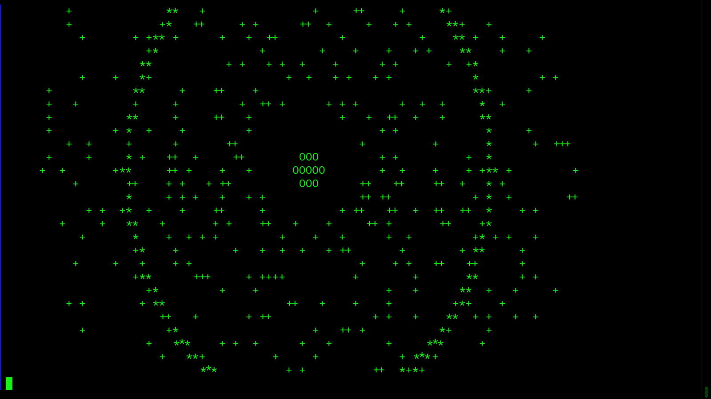

# ASCII Supernova Simulation
## Visualização científica de uma explosão estelar no terminal

Este projeto simula, diretamente no terminal, a explosão de uma estrela em **supernova** utilizando caracteres ASCII.  
A animação apresenta expansão esférica, ejeção de partículas, dissipação gradual de matéria estelar e formação de um **remanescente compacto**, representando uma estrela de nêutrons.

<p align="center">
  
</p>

O projeto combina ciência, programação de baixo nível e arte computacional, oferecendo uma experiência visualmente impactante e didática.

---

## Objetivo do projeto
- Visualizar um fenômeno astrofísico complexo de forma acessível.
- Servir como ferramenta de estudo, ensino e demonstração científica.
- Explorar animação e renderização no terminal usando C puro.
- Unir criatividade, ciência e computação.

---

## Base científica
Embora não seja uma simulação física exata, este projeto é inspirado em conceitos reais de astrofísica:
- Expansão radial representando a liberação de energia após colapso estelar.
- Distribuição angular de partículas simulando ejeção assimétrica.
- Dissipação gradual, sugerindo perda de energia e massa.
- Remanescente compacto central simbolizando estrela de nêutrons.
- Representação aproximadamente esférica para evitar distorções ASCII.

É um modelo artístico-científico, fundamentado mas acessível.

---

## Como compilar
Compile com GCC ou Clang. É necessário linkar a biblioteca matemática (`-lm`):

```bash
gcc supernova.c -o supernova -lm
```

## Como executar
```bash
./supernova
```

---
## Requisitos
- Linux, macOS ou Windows com terminal compatível
- Suporte a ANSI Escape Codes
- GCC ou Clang instalado

---
## Funcionalidades
- Renderização ASCII esférica convincente
- Animação fluida no terminal
- Expansão progressiva da estrela
- Partículas ejetadas
- Núcleo remanescente persistente
- Código simples, organizado e estudável

---
## Público-alvo
- Estudantes de astronomia
- Professores e educadores
- Entusiastas de computação científica
- Desenvolvedores curiosos
- Pessoas interessadas em ciência, arte e programação em C

---
## Contribuições
Contribuições são bem-vindas. Abra uma Issue ou envie um Pull Request.

Possíveis evoluções:
- Modos de explosão (Tipo II, Tipo Ia, etc.)
- Física aproximada pré-supernova
- Representação de ondas de choque
- Poeira interestelar
- Pulsar animado no núcleo
- Parâmetros configuráveis (tamanho, número de partículas, velocidade)

---
## Licença
Este projeto está licenciado sob a MIT License. Consulte o arquivo `LICENSE` para mais detalhes.

---
## Autoria
Desenvolvido por Bandeirinha — 2026  
Projeto educacional e aberto. Feito para inspirar curiosidade científica e criatividade computacional.
